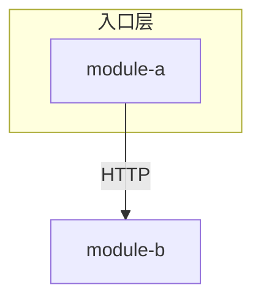

# 系统架构总览

<!-- 规则：每条论断带 file:line；没证据写「待确认」；代码块 ≤10 行；只写有代表性的，其余靠 file:line 指路；图用 mermaid；人工补充放 <!-- kb:manual --> … <!-- /kb:manual --> 里；frontmatter 只改 summary。 -->
<!-- 规划目标：{{goal}}；scan 提示：{{hints}} -->

## 系统边界

<!-- 系统是什么、不是什么；对外交互的系统。 -->

## 核心模块

| 模块 | 分层 / 角色 | 文档 |
|---|---|---|
| <module> | <入口层 / 应用层 / 领域 / 基础设施> | [x.md](../modules/x.md) |

## 系统架构图

<!-- 必须有：按分层画模块与外部系统，边上标协议（HTTP / gRPC / MQ / DB）。kb facts 给了依赖图骨架，可在其上分层。 -->

## 关键链路

<!-- 2–4 条最重要的链路，一行一条：入口 → 模块 → 模块 → 落库/外部；详细图在 business-flows.md。 -->

## 非功能要点

<!-- 部署形态、并发模型、可观测性；没有写「待补充」。 -->

## 引用文件

<!-- 正文出现过的文件各列一次：`- path:line — 作用`；lint 校验路径存在、行号不超范围。 -->

- <!-- kb:todo -->
