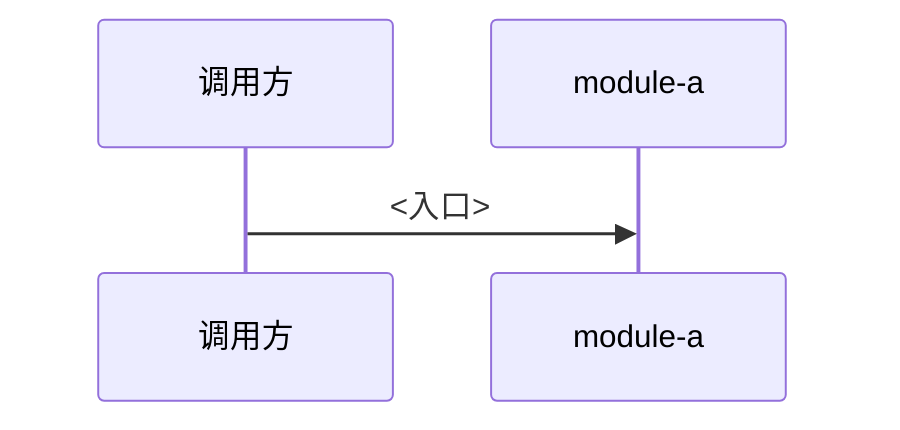

# 业务主链路与旁路

<!-- 规则：每条论断带 file:line；没证据写「待确认」；代码块 ≤10 行；只写有代表性的，其余靠 file:line 指路；图用 mermaid；人工补充放 <!-- kb:manual --> … <!-- /kb:manual --> 里；frontmatter 只改 summary。 -->
<!-- 规划目标：{{goal}}；scan 提示：{{hints}} -->

<!-- 每条链路一节：一句话 + 一张图（flowchart LR 或 sequenceDiagram）+ 关键步骤表（步骤 / 模块 / 代码位置）。主链路 1–2 条，旁路 2–4 条。 -->

## 主链路：<名字>

<一句话：从哪进、经过谁、落到哪。>

| 步骤 | 模块 | 代码位置 |
|---|---|---|
| 1 | <module> | <file:line> |

## 旁路：<名字>

## 排查顺序

<!-- 链路出问题先看哪、再看哪。 -->

## 引用文件

<!-- 正文出现过的文件各列一次：`- path:line — 作用`；lint 校验路径存在、行号不超范围。 -->

- <!-- kb:todo -->
