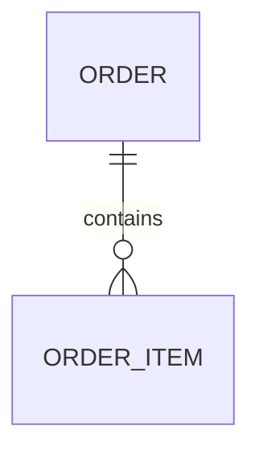

# 数据模型

<!-- 写作规则：每条论断后面写 file:line 或 file:起-止；scan 事实里没有、你也没亲自打开确认的，一律写「待确认」。代码块不超过 10 行，知识库只放引用不放实现。图用 mermaid。人工补充放在 <!-- kb:manual --> … <!-- /kb:manual --> 之间，重新生成时会按同名标题原位保留。frontmatter 只改 summary，其余由 flowctl kb draft 维护。 -->

<!-- 规划目标：{{goal}}。以 flowctl kb facts --page data-model 为底。 -->

## 实体与表

| 实体 | 表 / 集合 | 模块 | 定义 |
|---|---|---|---|
| `Order` | `t_order` | [module-order](modules/order.md) | <file:line> |

## DTO / 视图对象

<!-- 只列跨模块或对外契约里用到的。 -->

## 实体关系

<!-- 只画有证据（外键字段、关联注解、join 语句）的关系，边上写依据的 file:line。 -->

## 引用文件

<!-- 本页每一处 file:line 都要在这里出现一次；格式 `- path:line — 作用`。flowctl kb lint 会校验路径存在、行号不超范围。 -->

- <!-- kb:todo -->
